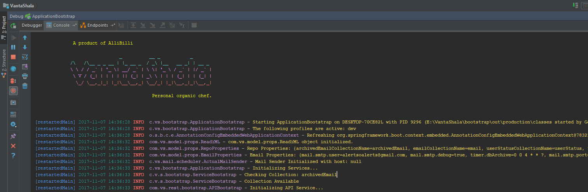

[](http://allibilli.com)  

[](https://semaphoreci.com/haigopi/vantashala)
[](http://allibilli.com)
[](https://raw.githubusercontent.com/spring-social/spring-social-google/master/LICENSE)
[](https://github.com/haigopi/VantaShala/issues)

# VantaShala.com
    A Personal Organic Chef. 

# Goals

  - Helping Society with healthy home cooked food. This is a real problem and we need a real solution.
  - Better than what you cook at home.
  - Healthy food means to be tasty too.
  - Traditional slow cooking process.

# Features
  - Let the Chefs publish what they will be cooking for coming week.
  - Users can then place the orders
  - Orders will get split dynamically to the chefs
  - And Chefs should deliver.
  - Cancellations can't be done once the chef accepted the order.
  - Order visulization should be a priority to the customer. 

### Installation

```sh

Install MongoDB and make it up and running.

Default Spring profile set to: dev
If change needed provide the environment: -Dspring.profiles.active=dev -Djasypt.encryptor.password=XXXXXXX
Configuration available under bootstrap resources.
No explict configuration required to set to run on your local machine
```
##### Below one represents a successful context load:

[](http://allibilli.com)


##### Below log represents a successful application start:
````apple js
[restartedMain] 2017-10-21 18:41:54 INFO  c.vs.bootstrap.VSServletInitializer - Configuring Springboot Servlet

              A product of AlliBilli
                               _          __ _           _
             /\   /\__ _ _ __ | |_ __ _  / _\ |__   __ _| | __ _
             \ \ / / _` | '_ \| __/ _` | \ \| '_ \ / _` | |/ _` |
              \ V / (_| | | | | || (_| | _\ \ | | | (_| | | (_| |
               \_/ \__,_|_| |_|\__\__,_| \__/_| |_|\__,_|_|\__,_|

                                           Personal organic chef.
........                                           
[restartedMain] 2017-11-07 14:36:37 INFO  c.vs.bootstrap.ApplicationBootstrap -  ****   ****************************   ****
[restartedMain] 2017-11-07 14:36:37 INFO  c.vs.bootstrap.ApplicationBootstrap -  ****   Hurray! Application Started.   ****
[restartedMain] 2017-11-07 14:36:37 INFO  c.vs.bootstrap.ApplicationBootstrap -  ****   ****************************   ****                                           
````

### Quick Technical Insights

    - gradle htmlDependencyReport
    - gradle build
    - gradle war
    - gradle projectReport
    - gradle :ui:bootRun - UI: http://localhost:8080/vs/index.html
    

### Swagger(BootRun)
    
    - http://localhost:8080/vs/rest/swagger.json
    - UI:  http://localhost:8080/vs/swagger/index.html
    
### CI/CD:
    https://semaphoreci.com/haigopi/vantashala    